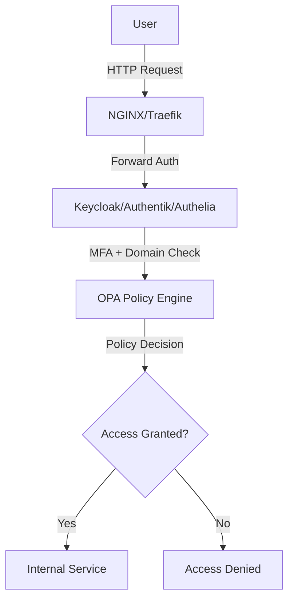
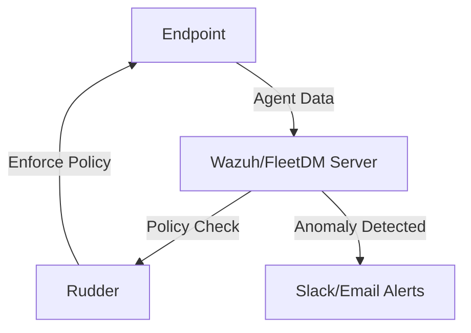

# Open Source Alternatives to Microsoft Entra Conditional Access and Intune

## 1. Executive Summary

Microsoft Entra Conditional Access and Intune are enterprise-grade tools for identity and access management (IAM) and endpoint device management, offering features like single sign-on (SSO), multi-factor authentication (MFA), domain-based access control, endpoint configuration, and data loss prevention (DLP). However, their subscription costs, complexity, and vendor lock-in can be prohibitive for small-to-mid-sized businesses (SMBs). This document outlines open-source alternatives that replicate key functionalities of Entra and Intune, tailored for DevOps, SysAdmins, and security engineers. By combining tools like Keycloak, Authelia, Authentik, Wazuh, FleetDM, Osquery, Rudder, pfSense, and Pi-hole, organizations can achieve robust IAM and endpoint management at a lower cost with greater customization and control. The document includes architecture diagrams, implementation considerations, and practical use cases to guide deployment.

## 2. Problem Statement

SMBs often seek alternatives to Microsoft Entra and Intune due to:

- **Cost**: Subscription fees for Microsoft 365 and associated services can strain budgets.
- **Vendor Lock-In**: Proprietary ecosystems limit flexibility and increase dependency.
- **Customization Needs**: Open-source solutions offer greater control over configurations and integrations.
- **Data Sovereignty**: Self-hosted solutions ensure sensitive data remains under organizational control.
- **Scalability**: SMBs need lightweight, scalable tools that align with lean IT resources.

Open-source alternatives provide cost-effective, auditable, and customizable solutions, though they require technical expertise for setup and maintenance.

## 3. Authentication and Conditional Access Tools

### A. Keycloak
- **Overview**: Keycloak, developed by Red Hat, is a mature open-source IAM solution under the Cloud Native Computing Foundation (CNCF). It supports enterprise-grade SSO, MFA, and role-based access control (RBAC).
- **Features**:
  - Protocols: OAuth 2.0, OpenID Connect (OIDC), SAML 2.0.
  - MFA: Supports TOTP, WebAuthn, and hardware tokens (e.g., YubiKey).
  - Domain-restricted login: Configurable to restrict access to specific domains (e.g., `company.com`).
  - Identity brokering: Integrates with external providers like Google, GitHub, or LDAP.
  - Admin UI: Comprehensive interface for managing users, roles, and policies.
- **Use Case**: Replaces Entra for SSO and conditional access, integrating with web apps, APIs, and internal services.
- **Integration Notes**:
  - Deploy with Docker or Kubernetes for scalability.
  - Use with reverse proxies like NGINX or Traefik for secure access.
  - Example: Configure Keycloak to enforce MFA for all users accessing a Kubernetes ingress.
- **Practical Tip**: Leverage Keycloak’s realm-based architecture to segregate user groups (e.g., employees vs. contractors) for granular policy enforcement.

### B. Authentik
- **Overview**: Authentik is a modern, flexible open-source identity provider designed for ease of use and integration with DevOps workflows.
- **Features**:
  - Protocols: OAuth 2.0, OIDC, SAML.
  - Adaptive MFA: Triggers based on user context (e.g., device, location).
  - LDAP/SAML integration: Connects to existing directories like Active Directory.
  - Customizable policies: Per-user or per-group access controls.
- **Use Case**: Lightweight alternative to Entra for web apps and DevOps pipelines.
- **Integration Notes**:
  - Deploy via Docker Compose for small setups or Helm for Kubernetes.
  - Supports API-first design for automation with CI/CD tools.
  - Example: Use Authentik with Traefik to secure internal dashboards.
- **Practical Tip**: Enable Authentik’s dashboard for a user-friendly interface to manage authentication flows.

### C. Authelia
- **Overview**: Authelia is a lightweight authentication server designed to work with reverse proxies like NGINX or Traefik.
- **Features**:
  - MFA: TOTP, WebAuthn, or hardware tokens.
  - User database: File-based or LDAP integration.
  - Access control: Restrict by user, group, or domain.
  - Lightweight: <20 MB container size, <30 MB memory usage.
- **Use Case**: Protects internal services behind a reverse proxy, ideal for minimal setups.
- **Integration Notes**:
  - Configure with NGINX or Traefik for forward authentication.
  - Example: Restrict access to internal tools like Grafana to `company.com` domain users.
- **Practical Tip**: Use Authelia’s login regulation to prevent brute-force attacks by limiting login attempts.

### D. Open Policy Agent (OPA)
- **Overview**: OPA is a policy engine for enforcing fine-grained, declarative access control across applications and infrastructure.
- **Features**:
  - Policy-as-code: Write policies in Rego for flexible control.
  - Integration: Works with Kubernetes, APIs, and microservices.
  - Context-aware: Evaluates user, device, or network conditions.
- **Use Case**: Implements conditional access policies, complementing Keycloak or Authentik.
- **Integration Notes**:
  - Deploy as a sidecar in Kubernetes or standalone service.
  - Example: Use OPA to deny access to sensitive APIs from untrusted networks.
- **Practical Tip**: Test policies in a staging environment using OPA’s CLI before production deployment.

## 4. Endpoint Monitoring Tools

### A. Wazuh
- **Overview**: Wazuh is an open-source SIEM and endpoint security platform, offering comprehensive monitoring and threat detection.
- **Features**:
  - File integrity monitoring (FIM): Detects unauthorized file changes.
  - Log collection and analysis: Aggregates logs from systems and applications.
  - Vulnerability detection: Correlates endpoint data with CVE databases.
  - Compliance: Supports PCI DSS, HIPAA, and GDPR requirements.
- **Use Case**: Monitors endpoints for unauthorized app usage or data transfers.
- **Integration Notes**:
  - Deploy agents on Windows, macOS, and Linux endpoints.
  - Integrate with Elastic Stack for advanced visualization.
  - Example: Alert on login attempts to `login.live.com` via Wazuh rules.
- **Practical Tip**: Configure Wazuh’s active response to automatically block suspicious processes.

### B. FleetDM + Osquery
- **Overview**: FleetDM is a management platform for Osquery, an open-source endpoint telemetry tool.
- **Features**:
  - Real-time queries: Monitor system state, installed software, and browser extensions.
  - Policy enforcement: Detect and alert on disallowed apps.
  - Cross-platform: Supports Windows, macOS, and Linux.
- **Use Case**: Enforces app usage policies and monitors login sessions.
- **Integration Notes**:
  - Deploy FleetDM server with Docker; install Osquery agents on endpoints.
  - Example: Query for unauthorized browser extensions like OneDrive plugins.
- **Practical Tip**: Use FleetDM’s live query feature for real-time incident response.

### C. Rudder
- **Overview**: Rudder is an open-source configuration management tool for enforcing system policies.
- **Features**:
  - Policy enforcement: Ensures desired system state (e.g., firewall rules, software).
  - Automation: Remediates non-compliant configurations.
  - Reporting: Tracks compliance across endpoints.
- **Use Case**: Pushes configuration policies to block unauthorized apps.
- **Integration Notes**:
  - Deploy Rudder server on Linux; agents on managed endpoints.
  - Example: Enforce a policy to disable OneDrive on Windows endpoints.
- **Practical Tip**: Use Rudder’s inventory to audit software versions across the fleet.

## 5. DNS and Application Blocking

### A. pfSense + pfBlockerNG
- **Overview**: pfSense is an open-source firewall and router; pfBlockerNG is a plugin for DNS and IP-based filtering.
- **Features**:
  - DNS filtering: Blocks domains like `login.live.com`, `outlook.live.com`.
  - IP blocking: Restricts access to known Microsoft personal service IPs.
  - GeoIP filtering: Limits access by geographic region.
- **Use Case**: Prevents access to personal Microsoft services at the network level.
- **Integration Notes**:
  - Deploy pfSense on dedicated hardware or a VM.
  - Configure pfBlockerNG with blacklists for Microsoft consumer domains.
  - Example: Block `onedrive.live.com` to prevent data uploads.
- **Practical Tip**: Regularly update pfBlockerNG’s blocklists for accuracy.

### B. Pi-hole
- **Overview**: Pi-hole is a lightweight DNS sinkhole for network-wide ad and tracker blocking.
- **Features**:
  - Domain blacklisting: Blocks Microsoft personal service domains.
  - Low resource usage: Runs on Raspberry Pi or Docker.
  - Reporting: Tracks blocked DNS queries.
- **Use Case**: Filters personal Microsoft account logins at the DNS level.
- **Integration Notes**:
  - Deploy on a Raspberry Pi or Linux server.
  - Example: Add `login.live.com` to Pi-hole’s blacklist.
- **Practical Tip**: Combine Pi-hole with a VPN for remote device filtering.

## 6. Detailed Architecture Diagrams and Flow

### Authentication Flow
1. **User Request**: User attempts to access an internal service (e.g., web app).
2. **Reverse Proxy**: NGINX/Traefik forwards the request to Keycloak/Authentik/Authelia.
3. **Authentication**: User authenticates with MFA and domain-based restrictions.
4. **Policy Check**: OPA evaluates conditional access policies (e.g., device compliance).
5. **Access Granted/Denied**: Service access is granted based on policy compliance.



### Endpoint Monitoring Flow
1. **Endpoint Agent**: Wazuh/Osquery agents collect system data.
2. **Central Server**: Data is sent to Wazuh/FleetDM for analysis.
3. **Policy Enforcement**: Rudder pushes compliance policies.
4. **Alerting**: Unauthorized activity triggers Slack/email alerts.



## 7. Implementation Considerations and Limitations

- **Setup Complexity**: Open-source tools require technical expertise for deployment and maintenance compared to Microsoft’s managed services.
- **Scalability**: Keycloak and Wazuh scale well but may need additional resources for large deployments.
- **Feature Parity**: Full replication of Entra’s conditional access or Intune’s mobile device management (MDM) is challenging; focus on core needs (e.g., SSO, app control).
- **Maintenance**: Regular updates and security patches are critical; allocate IT resources accordingly.
- **Integration**: Tools like OPA require custom policy development, increasing setup time.
- **Limitations**:
  - Authelia lacks native social login support.
  - FleetDM/Osquery may not fully replace Intune’s MDM for mobile devices.
  - DNS filtering (Pi-hole/pfSense) can be bypassed by savvy users.

**Practical Tip**: Use container orchestration (e.g., Kubernetes) for scalable deployments and automate updates with CI/CD pipelines.

## 8. Comparison Table with Microsoft Products

| **Feature**                     | **Microsoft Entra** | **Keycloak/Authentik/Authelia** | **Microsoft Intune** | **Wazuh/FleetDM/Rudder** |
|---------------------------------|---------------------|---------------------------------|---------------------|--------------------------|
| **SSO**                        | Yes                 | Yes (OAuth2, OIDC, SAML)       | N/A                 | N/A                      |
| **MFA**                        | Yes                 | Yes (TOTP, WebAuthn)           | Yes                 | Partial (via alerts)     |
| **Domain Restriction**         | Yes                 | Yes                            | N/A                 | N/A                      |
| **Endpoint Monitoring**        | Partial             | No                             | Yes                 | Yes                      |
| **App Control**                | Yes                 | Partial (via OPA)              | Yes                 | Yes                      |
| **DLP**                        | Yes                 | Partial (via Wazuh rules)      | Yes                 | Yes                      |
| **Ease of Use**                | High                | Moderate                       | High                | Moderate                 |
| **Cost**                       | Subscription        | Free (self-hosted)             | Subscription        | Free (self-hosted)       |
| **Customization**              | Moderate            | High                           | Moderate            | High                     |

## 9. Sample Use Cases

### A. Blocking Personal Microsoft Logins
- **Tools**: Wazuh + Pi-hole/pfSense
- **Setup**:
  - Configure Wazuh to monitor browser logs for `login.live.com` access.
  - Add Microsoft consumer domains (e.g., `outlook.live.com`, `onedrive.live.com`) to Pi-hole/pfSense blacklists.
  - Set Wazuh rules to trigger Slack alerts on detection.
- **Example Rule (Wazuh)**:
  ```xml
  <rule id="100001" level="12">
    <if_sid>53000</if_sid>
    <url>login.live.com</url>
    <description>Attempted access to personal Microsoft account</description>
    <action>alert_slack</action>
  </rule>
  ```
- **Outcome**: Prevents data leaks to personal Microsoft accounts.

### B. Enforcing MFA
- **Tools**: Keycloak/Authentik
- **Setup**:
  - Configure Keycloak/Authentik to require TOTP for all users.
  - Integrate with NGINX/Traefik for service access.
  - Example (Keycloak): Set MFA as a required action in the authentication flow.
- **Outcome**: Ensures secure access to internal services.

## 10. Conclusion and Practical Recommendations

While open-source tools cannot fully replicate the seamless integration of Microsoft Entra and Intune, a combination of Keycloak/Authentik/Authelia for IAM, Wazuh/FleetDM/Rudder for endpoint management, and pfSense/Pi-hole for DNS filtering offers a robust, cost-effective alternative for SMBs. **Recommendations**:
- **Start Small**: Deploy Keycloak and Wazuh for core IAM and monitoring.
- **Automate**: Use Docker/Kubernetes for deployment and Ansible for configuration management.
- **Monitor**: Set up alerting (e.g., Slack) for real-time incident response.
- **Test**: Validate policies in a staging environment to avoid production issues.
- **Community Support**: Leverage GitHub and Discord communities for Keycloak, Authentik, and Wazuh.

This architecture empowers SMBs with auditable, customizable security while avoiding vendor lock-in. For advanced setups, consider integrating a Git repository for managing FleetDM queries or Keycloak realms.